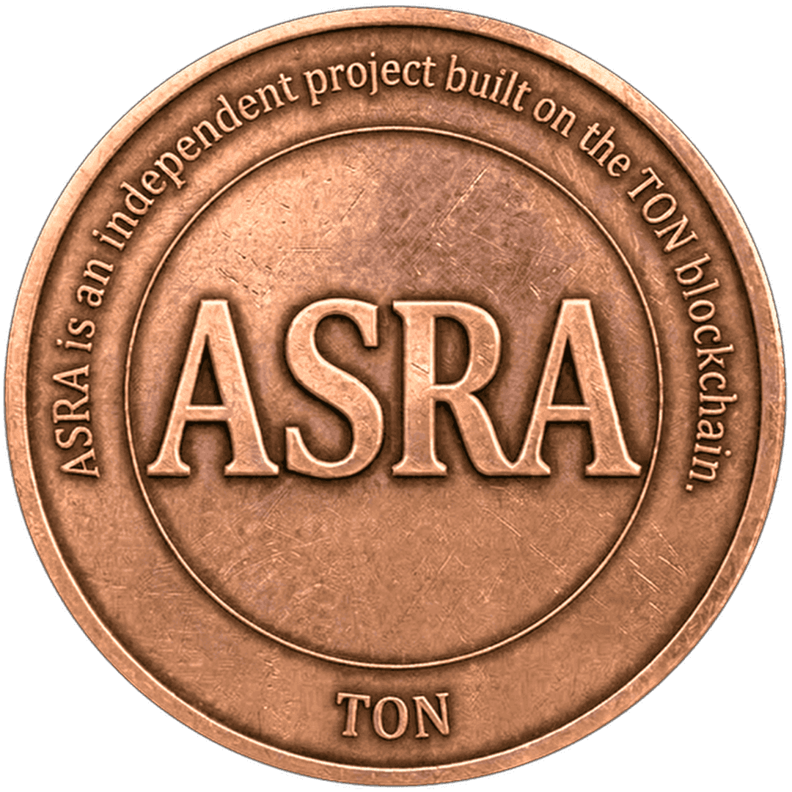

# ASRA Ton Token

**ASRA** is a utility token on the TON blockchain designed for in-game payments and rewards.

## Token Details

| Property | Value |
|----------|-------|
| **Name** | ASRA Ton |
| **Symbol** | ASRA |
| **Decimals** | 9 |
| **Total Supply** | 1,000,000,000 ASRA |
| **Contract** | `EQA8Mx1E9_RXEroXSW7PI5EHwEAMxAMhwKLXTlKX-3uQOJWy` |

## Key Features

- **Fixed Supply**: One-time mint only. No additional tokens will ever be created.
- **Low Fees**: Lower transaction fees compared to other tokens for in-game payments.
- **Game Integration**: ASRA is used for payments and withdrawals in our Telegram Web game bot.

## Game Ecosystem

ASRA powers the in-game economy:

- **Payments**: Use ASRA for in-game purchases and upgrades
- **Withdrawals**: Withdraw your game earnings in ASRA or convert to TON
- **Telegram Web**: Play directly in Telegram with seamless wallet integration

## Verified Contract

The contract source code is verified on TON Verifier:
https://verifier.ton.org/EQA8Mx1E9_RXEroXSW7PI5EHwEAMxAMhwKLXTlKX-3uQOJWy

## Trade ASRA

- **STON.fi**: https://app.ston.fi/swap?chartVisible=true&chartInterval=24h&ft=TON&tt=EQA8Mx1E9_RXEroXSW7PI5EHwEAMxAMhwKLXTlKX-3uQOJWy
- **DYOR**: https://dyor.io/ru/token/EQA8Mx1E9_RXEroXSW7PI5EHwEAMxAMhwKLXTlKX-3uQOJWy

## Links

- **Game Bot**: https://t.me/asragamebot
- **Metadata**: https://raw.githubusercontent.com/asratonofficial/ASRA-ton/master/jetton-metadata.json
- **Logo**: https://raw.githubusercontent.com/asratonofficial/ASRA-ton/master/ASRA.png

## Coming Soon

Full game launch with ASRA rewards system. Stay tuned!

---

*ASRA - Built for gamers on TON*
